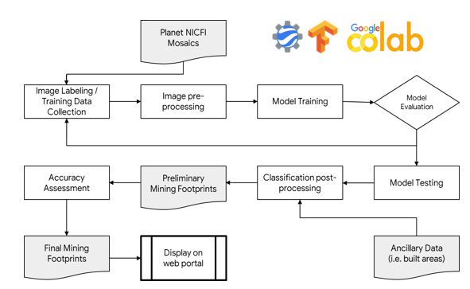
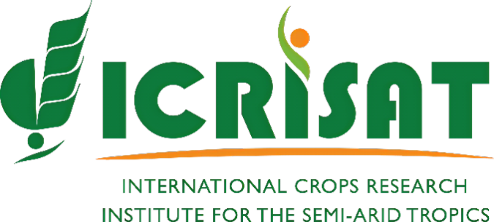

# Artisanal Small-scale Mining Monitoring Service 
[LICENSE][license-url]
## Introduction
Small-scale mining is an important source of livelihood for areas associated with alluvial gold deposits. 
However, it is also a major driver of freshwater pollution, forest and land degradation, and deforestation, 
not to mention poor worker safety and child labour. 
Despite attempts by regulatory authorities to control galamsey activities, 
it has expanded rapidly with dire consequences including contaminated soils and water bodies.

With the advent of freely available earth observation data and cloud computing resources, 
CERSGIS under the NASA/SERVIR West Africa program since 2018 has explored and developed methodologies based on satellite imageries (Sentinel 1, Sentinel 2, Planet NICFI Monthly Mosaics) to identify and quantify 
the extent of galamsey activities in the high forest zone of Ghana, where these activities are widespread.

The Monitoring of Small-Scale Mining (Galamsey) Sites in Ghana service, 
has a [monitoring platform](https://servir.cersgis.org/map) with information on the location of illegal mining sites across Ghana and their associated land degradation. 
It provides the necessary spatial data input to decision-makers and partners, such as A Rocha Ghana, who will use the information to target areas for remediation and landscape restoration activities. 
It also has a [mobile application](https://play.google.com/store/apps/details?id=org.cersgis.trueking.landscapeghv2&pli=1) for collecting data on the field.

## Methodology and Workflow
Cersgis has constantly improved methods for tracking small-scale mining activity since the service's launch.  One effective approach analyzes satellite images using [Sentinel-1 Thresholding](https://code.earthengine.google.com/3b157ef69f6b22bc68f236b96f4b57c3) on Google Earth Engine. While valuable, this method can be hampered by weather, land cover variations, or limited data availability. The current phase of the project tackles this challenge with deep learning, a powerful technique where computers learn from data. This method utilizes a U-Net deep learning model and high-resolution satellite imagery from Planet's NICFI program.
The deep learning approach for tracking small-scale mining activity involves several key steps:
1.	**Image Acquisition and Processing**: High-resolution satellite imagery is acquired from Planet's NICFI program. Standard remote sensing techniques like cloud masking and median yearly composite generation are applied within Google Earth Engine (GEE) to prepare the images.
2.	**Data Labeling**: Ground truth data is crucial for training the model. This involves manually labeling a separate image (mask) for each training image. Pixels corresponding to potential mining sites are assigned a value of 1, while all others are assigned a 0. Software like Labelbox can be used to streamline this process.
3.	**Data Pre-processing**: The labelled data is then split into three sets: training, validation, and testing. The training set trains the model, the validation set prevents over-fitting, and the testing set evaluates the model's generalization. Techniques like resizing or normalization may also be applied to improve training efficiency.
4.	**Model Development (Python)**: A U-Net model is built using Python and a deep learning framework like TensorFlow within Google Colab. U-Net is a popular architecture consisting of an encoder (extracts features) and a decoder (reconstructs the image, highlighting objects of interest).
5.	**Model Training (Python)**: The training data is fed into the U-Net model in Google Colab. The model learns to identify the characteristics of potential mining sites within the images. A loss function, like binary cross-entropy, measures the model's performance and guides training. The validation set is continuously monitored to prevent over-fitting.
6.	**Model Evaluation (Python)**: Once trained, the model's performance is evaluated on the testing set using metrics like Intersection over Union (IoU) to assess its accuracy in identifying potential mining sites.
7.	**Fine-tuning (Optional)**: Based on the evaluation, the model architecture or training process may be further refined for improved performance, using Python in Google Colab.
8.	**Deployment**: The final, optimized model can then be deployed to analyze new satellite images for potential illegal mining activity detection.
9.	**Post-processing**: Within GEE, additional data sources like settlement layers, road networks, and legal mining concessions are incorporated to create a comprehensive mask. This mask refines the initial mining footprints by removing irrelevant areas and incorporating expert-generated masks for additional accuracy.

    
  

    
# Project Partners
We appreciate all the support from our partners below. 
<table style="border: 0;">
  <tr> 
    <td></td>
    <td></td>
    <td></td>
    <td></td>
  </tr>
</table>
 

 

[license-url]: https://github.com/CERSGIS/Small-Scale-Mining-Sites-Monitoring/blob/main/LICENSE